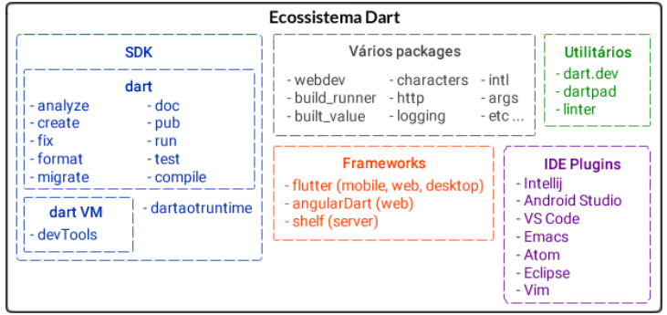
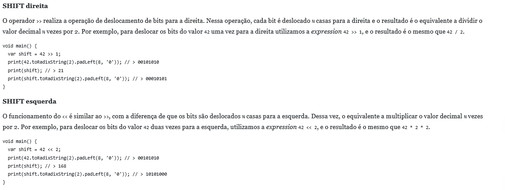
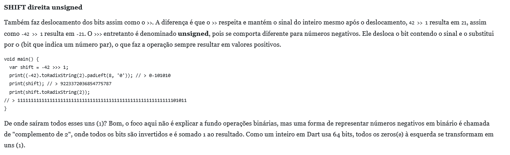
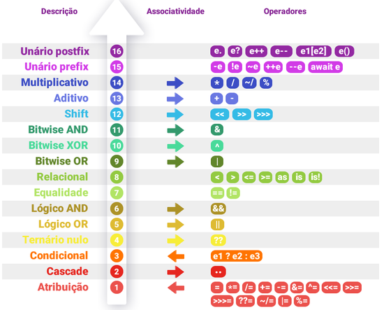

# Análise atividade:
Página atual: 7

Total páginas (de conteúdo): 14 páginas (15 se contar a última página - similar a uma página de "considerações finais", pode ser ignorada)

Páginas por dia até o prazo final (08/09): 21 dias no total, 0.71 páginas por dia (15 páginas) ou 0.66 (14 páginas) ou 0.76 (considerando os 16 capítulos).

# Anotações:

## Hello, Dart!

A linguagem se baseou em vários pontos positivos de linguagens anteriores.
Sua primeira *spec* (Documentação) aberta ao público foi em outubro de 2011 e apresentada em uma conversa no encontro anual Google I/O em junho de 2012. E teve seu primeiros lançamentos por volta da troca de ano em 2012 e 2013, em outubro de 2014 foi lançada a primeira versão oficial 1.0.

Nos primeiros anos, diversas melhorias foram implementadas, incluindo 8 versões novas em torno de 1 ano (outubro 2013 - outubro 2014), em julho de 2014 a linguagem foi oficialmente aceita pelo ECMA.

Foi desenvolvido um framword experimental para desenvolvimento em sistemas mobile, chamado de **Sky** que acabou sendo, futuramente, renomeado para Flutter.

Quando 2016 estava em seu ápice, Dart já estava em um meio multiplataformico, e o Flutter já era algo explorado continuamente, comprovando a maturidade e adaptação da linguagem.

Em 2018, Flutter já era muito popular e crescia cada vez mais, a versão 2.0 alcançou o público, a qual já trazia o *strong mode* por padrão, ou seja, a tipagem da linguagem passa a ser restrita e traz um avanço em análise e prevenção de erros. Antes disso o modo era opcional.

No final do ano, Flutter teve oficionalmente sua primeira versão estável.

Várias funções testes entravam em *preview* que era basicamente algo opcional que poderia ser ativado, para que houvesse o feedback da comunidade.

Em 2021, as funções *preview* de *null safety* e *dart:ffi* foram lançadas oficialmente.

Dart permite a compilação:

**JIT**: Just in Time, de forma inteligente, com a aplicação rodando, consegue identificar quais partes do código você alterou e recompilar sem que seja necessário um *rebuild* completo. Com isso, o feedback das alterações é quase imediato, elevando produtividade e diminuindo o ciclo de desenvolvimento (*hot reload* no Flutter).

**AOT**: Ahead of Time, usado por linageuns com tipagem estática, nas quais a compilação é feita anteriormente ao deploy e execução. Que gera os binários que rodarão de forma otimizada em VM's ou Browser.

Dart nasceu e continua *Open Source*.

Ecossistema Dart: .

## O básico

Operadores e Estruturas de controle:

Operadores:

- (+,-, *, /, ~/, %), (==, !=, > / >=, < / <=), (&&, ||, !()), 
- (&, |, ^, ~, <<, >>, >>>) ->  (AND, OR, XOR, NOT, Deslocamento de bit para a esquerda, para a direta, deslocamento de bit para a direta sem signal (unsigned))
imagens de referência:  | 
- (= , +=, -=, *=, /=, ~/=, %=, &=, |=, <<=, >>=, >>>=)
- (var++, var--, --var: diminui um antes de usar a variável, ++var: diminui um antes de usar a variável) -> ()
- (as, is, is!) - (41 as/is/!is String)
- (., (), .., ..., a ? b : c, [])
- (??, ??=, ?., ?.., ?[], expression!)
- 

Estruturas de controle

- if / else
- switch / case
- while
- do while
- for
- for in (for vogal in vogais)
- assert

## Benditos tipos:

Symbol: 
var mod = #modificador
print(#modificador); // Symbol("modificador")
print(mod); //Symbol("modificador")

